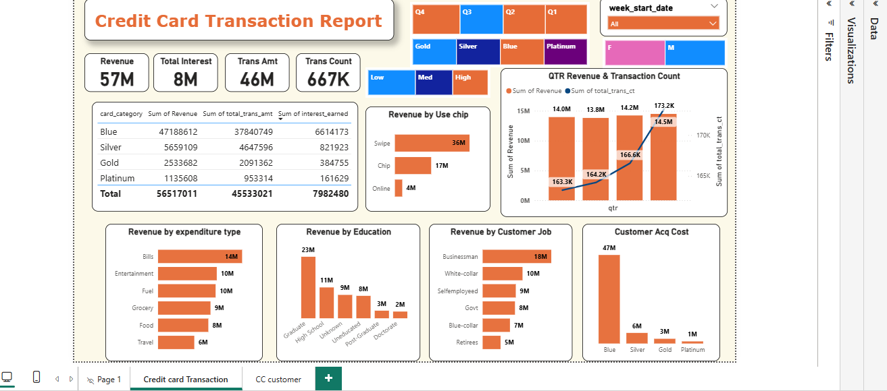
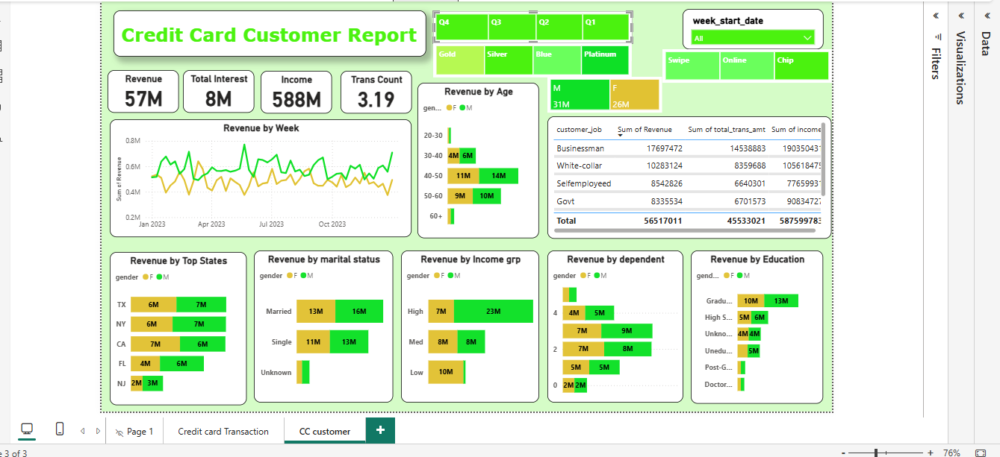

# Credit Card Weekly Dashboard (Power BI)

## Problem Statement
A financial services company wants to analyze its credit card operations using transaction and customer data.  
The objective of this project is to build interactive dashboards that help monitor revenue performance, customer behavior, and transaction trends.

This project includes two dashboards:
1. Credit Card Transaction Report
2. Credit Card Customer Report

---

## Executive Summary
The Credit Card Weekly Dashboard provides insights into credit card performance using key metrics such as revenue, transaction amount, customer count, and operational indicators.

The analysis shows **total revenue of 57M**, **total transaction amount of 46M**, and **total interest earned of 8M**.  
Week-over-week analysis indicates **28.8% growth in revenue**, showing increased credit card usage.

Male customers contribute **31M revenue**, while female customers contribute **26M**.  
Blue and Silver credit cards account for **93% of overall transactions**, and **TX, NY, and CA contribute 68% of total revenue**.

The dashboard also tracks important operational metrics such as **activation rate (57.5%)** and **delinquency rate (6.06%)**.

---

## Business Questions
The dashboards answer the following business questions:

- What is the total revenue generated from credit card transactions?
- How does revenue change week over week?
- What is the total transaction amount and transaction count?
- Which customer segments contribute the most revenue?
- Which credit card categories generate the most transactions?
- Which states contribute the highest revenue?
- What is the credit card activation rate?
- What is the delinquency rate among customers?

---

## Tools Used
- Power BI  
- SQL  
- Power Query  
- DAX  
- Data Modeling

  
## Data Model

The following data model was created in Power BI to establish relationships between transaction and customer datasets.

---

## Dashboard 1: Credit Card Transaction Report
This dashboard focuses on analyzing transaction performance and revenue trends.

Key insights include:
- Total revenue generated from transactions
- Transaction amount and count analysis
- Revenue distribution by card category
- Revenue contribution by states
- Weekly revenue trend analysis

---

## Dashboard 2: Credit Card Customer Report
This dashboard focuses on customer behavior and engagement.

Key insights include:
- Customer count analysis
- Revenue contribution by gender
- Customer activation rate
- Delinquency rate analysis
- Customer segmentation insights

---

## Business Value
This project helps businesses:

- Monitor credit card revenue performance
- Understand customer spending behavior
- Identify high-performing regions and card categories
- Track customer activation and engagement
- Monitor credit risk using delinquency metrics
- Support data-driven decision making

  ## Dashboard Preview
### Credit Card Transaction Report

### Credit Card Customer Report

